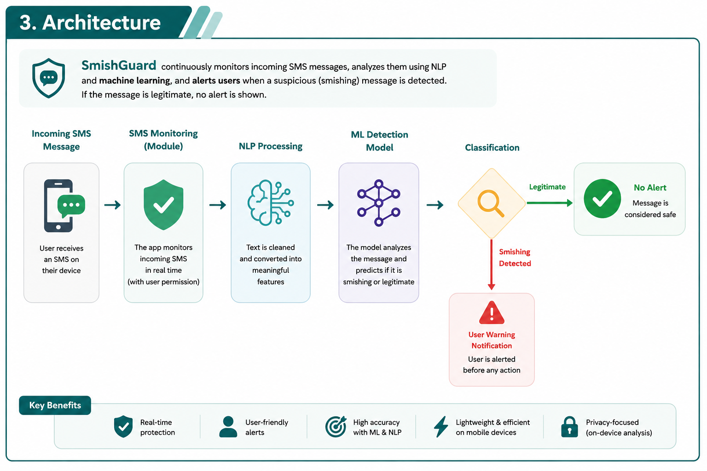
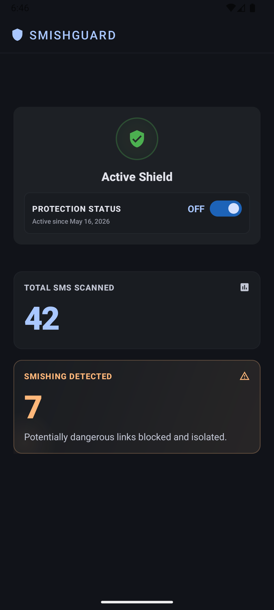
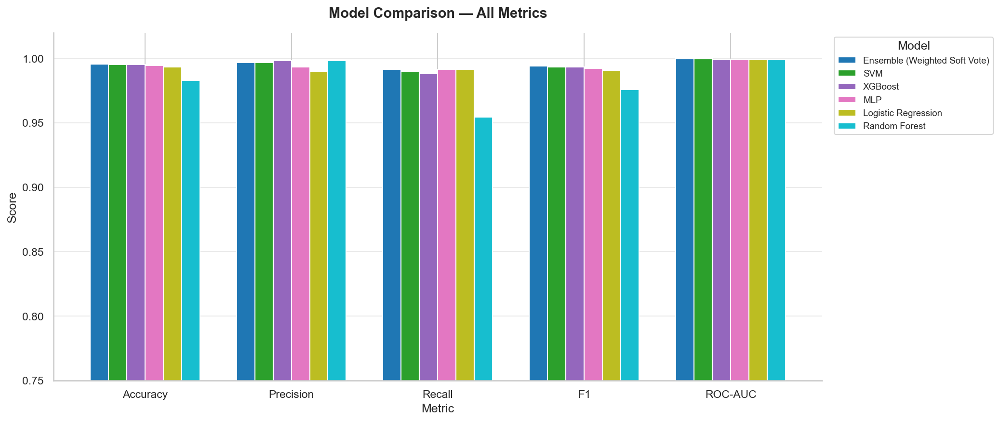

<div align="center">


# SmishGuard

### Real-time SMS phishing (smishing) detection, powered by NLP + Machine Learning

[](model)
[](backend)
[](model)
[](model)
[](model)
[](app)


*Final Degree Project · Computer Science, Afeka College of Engineering*

*Itamar Hadad · Neta Elbaz · Advisor: Victor Taubkin*

</div>

---

## Table of Contents

- [The Problem](#the-problem)
- [The Solution](#the-solution)
- [How It Works](#how-it-works)
- [Screenshots](#screenshots)
- [Repository Structure](#repository-structure)
- [Results](#results)
- [Tech Stack](#tech-stack)
- [Getting Started](#getting-started)
- [Documentation](#documentation)

---

## The Problem


**Smishing** (SMS phishing) attacks are growing every year. Attackers impersonate banks, delivery services, and government agencies to trick victims into clicking malicious links or sharing personal and financial information over text message.

- Messages are crafted to look completely legitimate.
- **Elderly users and people less familiar with technology are disproportionately targeted** and struggle to tell a real bank notification from a fake one.
- Existing spam filters are built for email, not SMS, and are not tuned to catch evolving phishing patterns.
- By the time a user realizes a message was fake, they may have already clicked the link.

<br clear="right"/>

## The Solution

**SmishGuard** is an end-to-end system that intercepts incoming SMS messages on an Android device, classifies them in real time using a hybrid NLP + ML pipeline, and warns the user *before* they interact with a suspicious message, while staying silent for legitimate ones.

The project has three independently runnable parts, each documented in its own README:

| Part | What it does | Docs |
|---|---|---|
| 🧠 **Model** | Trains and serves the smishing classifier: Sentence-BERT embeddings + engineered text signals + TF-IDF, fed into 5 candidate classifiers and a weighted ensemble | [`model/README.md`](model/README.md) |
| ⚙️ **Backend** | A FastAPI microservice that loads the trained model and exposes a single `POST /analyze-sms` endpoint | [`backend/README.md`](backend/README.md) |
| 📱 **App** | An Android app that listens for incoming SMS, sends it to the backend, and raises a notification when smishing is detected | [`app/README.md`](app/README.md) |

## How It Works

<div align="center">

</div>

1. **Incoming SMS** is intercepted on-device by a `BroadcastReceiver` the moment it arrives.
2. The message is handed to a background **WorkManager** job so analysis survives app/process death.
3. The **backend** preprocesses the text and extracts a feature vector: a 384-dim Sentence-BERT embedding, binary URL/phone flags, 14 engineered phishing-signal features (urgency words, threat words, shortened URLs, suspicious domains, etc.), and 50 TF-IDF terms.
4. A **weighted soft-voting ensemble** of 5 classifiers (Logistic Regression, SVM, Random Forest, XGBoost, MLP) scores the message against a tuned decision threshold.
5. **Legitimate messages pass through silently.** Suspicious messages trigger an in-app notification warning the user *before* they act on the message.

A hard safety rule short-circuits the model entirely: a message with no URL, email, or phone number cannot be smishing (there's no call-to-action to exploit), so it's classified as `ham` without ever touching the classifier.

## Screenshots

<div align="center">

&nbsp;&nbsp;&nbsp;

</div>

## Repository Structure

```
SmishGuard/
├── model/                  # ML pipeline: training + inference
│   ├── MLsmish.py          # training pipeline & predict_message() inference entry point
│   ├── NLP_smish.py        # text preprocessing & regex-based phishing-signal detectors
│   ├── create_graph.py     # EDA graph generation
│   ├── runModel.py         # quick manual test script
│   ├── dataset/            # labeled SMS datasets
│   ├── graphs/             # generated EDA + evaluation plots
│   └── *.pkl               # trained model, label encoder, TF-IDF vectorizer, threshold
│
├── backend/                # FastAPI service
│   └── app/
│       ├── main.py         # app entry point, CORS, lifespan model loading
│       ├── routes/         # POST /analyze-sms
│       ├── schemas/        # request/response models
│       └── services/       # bridges to the ML pipeline in ../model
│
└── app/                    # Android app (separate git repository)
    └── app/src/main/java/com/example/smishguard/
        ├── receiver/       # SMS BroadcastReceiver + boot receiver
        ├── worker/         # WorkManager background analysis job
        ├── data/           # Retrofit API client (mock + real) and local stats storage
        ├── notification/   # phishing alert notifications
        └── ui/              # permission flow + home dashboard
```

## Results

All 5 candidate classifiers plus the ensemble score above **95% on accuracy, precision, recall, F1, and ROC-AUC** on the held-out test set, with the weighted soft-voting ensemble coming out on top on F1, the metric used to pick the deployed model.

<div align="center">

</div>

The full evaluation (per-model confusion matrices, ROC curves, and dataset EDA) is generated automatically by the training pipeline and lives in [`model/graphs/`](model/graphs/). See [`model/README.md`](model/README.md#results) for the complete breakdown.

## Tech Stack

| Layer | Technologies |
|---|---|
| **NLP / Embeddings** | Sentence-Transformers (`all-MiniLM-L6-v2`), TF-IDF (scikit-learn) |
| **Classifiers** | Logistic Regression, SVM, Random Forest, XGBoost, MLP, weighted `VotingClassifier` ensemble |
| **Backend** | FastAPI, Pydantic, Uvicorn, deployed on Render |
| **Mobile** | Kotlin, Android WorkManager, Retrofit + OkHttp, Gson, WorkManager, Android Notifications |

## Getting Started

Each part can be run independently. See its README for full setup instructions:

```bash
# 1. Train / regenerate the model
cd model && pip install -r ../backend/requirements.txt && python MLsmish.py

# 2. Run the backend API
cd backend && pip install -r requirements.txt && uvicorn app.main:app --reload --port 8000

# 3. Build & run the Android app
cd app && ./gradlew assembleDebug
```

## Documentation

- [`model/README.md`](model/README.md): dataset, feature engineering, training pipeline, results
- [`backend/README.md`](backend/README.md): API reference, architecture, deployment
- [`app/README.md`](app/README.md): Android app features, architecture, build & configuration
- [`SmishGuard Project Book.pdf`](SmishGuard%20Project%20Book.pdf): the full final degree project report

---

<div align="center">
<sub>Final Degree Project · Computer Science · Afeka College of Engineering</sub>
</div>
