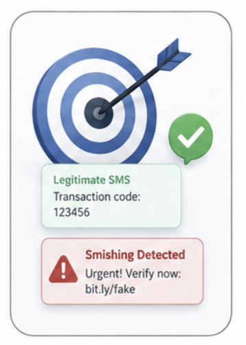
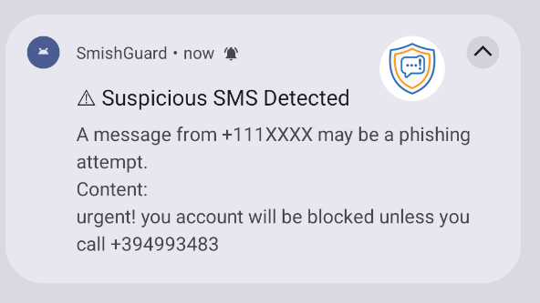

<div align="center">


# SmishGuard: Android App

**Watches incoming SMS in the background and warns you before you interact with a phishing message.**

[]()
[]()
[]()
[]()

</div>

This is the Android client of the [SmishGuard](https://github.com/netaelbaz/SmishGuardFrontend) project. It intercepts incoming SMS on-device and sends it to the [SmishGuard backend](../backend) for classification, then raises a notification if the message looks like phishing.

> This app is developed as its own git repository (independent of the ML/backend repo it's normally deployed alongside), since it has its own build tooling, release cycle, and Gradle wrapper.

## Screenshots

<div align="center">

&nbsp;&nbsp;&nbsp;

</div>

## Features

- **Real-time SMS interception** via a `BroadcastReceiver`, the instant a message arrives (no polling).
- **Background analysis with WorkManager**, so the check survives app/process death and retries automatically (linear backoff, up to 3 attempts) if the backend is briefly unreachable.
- **Silent for legitimate messages**: a notification is only raised when the backend flags a message as smishing.
- **Sender masking** in notifications (`+1234XXXX`) and stripped URLs in the message preview, so the alert itself never becomes a vector for a second click-through.
- **Survives reboots**: a `BootReceiver` re-arms SMS monitoring on device restart.
- **Mock/Real API toggle**: ships with an offline, keyword-based `MockApiService` for demos and instrumented tests, and a Retrofit-backed `RealApiService` for the live backend, switched via a single build flag.
- **Local usage stats** (total scanned, total flagged) persisted on-device.

## Permissions

| Permission | Why |
|---|---|
| `RECEIVE_SMS`, `READ_SMS` | Read the content of an incoming SMS to analyze it |
| `POST_NOTIFICATIONS` | Show the phishing alert (Android 13+ requires runtime consent) |
| `INTERNET` | Call the backend's `/analyze-sms` endpoint |
| `RECEIVE_BOOT_COMPLETED` | Re-register the SMS receiver after a device reboot |
| `FOREGROUND_SERVICE` | Support for long-running background analysis |

`PermissionActivity` is the launcher entry point and blocks access to the home screen until SMS + notification permissions are granted.

## Architecture

```
app/src/main/java/com/example/smishguard/
├── MainActivity.kt                    Home screen host
├── SmishGuardApp.kt                   Application class + SmishGuardAppContainer (manual DI singleton)
├── receiver/
│   ├── SmsReceiver.kt                 BroadcastReceiver on SMS_RECEIVED_ACTION → enqueues analysis
│   └── BootReceiver.kt                Re-arms monitoring after BOOT_COMPLETED
├── worker/
│   └── SmsAnalysisWorker.kt           CoroutineWorker: calls the repo, notifies on a phishing verdict, retries on failure
├── data/
│   ├── remote/
│   │   ├── ApiService.kt              Common interface
│   │   ├── MockApiService.kt          Offline keyword-matching stub (used when USE_MOCK_API = true)
│   │   ├── RealApiService.kt          Retrofit + OkHttp client hitting the deployed backend
│   │   ├── AnalysisRequest.kt / AnalysisResponse.kt   Wire models (Gson, @SerializedName mapping to the backend's snake_case JSON)
│   ├── repository/SmsAnalysisRepo.kt  Orchestrates the API call + local stats update
│   └── storage/StatsStore.kt          Persists total-scanned / total-flagged counts
├── notification/NotificationHelper.kt  Builds and shows the phishing alert notification
└── ui/
    ├── home/HomeViewModel.kt          Exposes scan stats + protection status to the home screen
    └── permission/PermissionActivity.kt  Launcher activity; gates the app behind SMS + notification permission grants
```

**Data flow:** `SmsReceiver` → `SmsAnalysisWorker` → `SmsAnalysisRepo` → `ApiService` (mock or real) → on a phishing verdict, `NotificationHelper.sendAlert()`.

## Configuration

The mock/real backend choice and the backend URL are build-time flags in `app/build.gradle.kts`:

```kotlin
defaultConfig {
    buildConfigField("boolean", "USE_MOCK_API", "true")
    buildConfigField("String", "API_BASE_URL", "\"https://gamma-bridged-raisin.ngrok-free.dev\"")
}

buildTypes {
    release {
        buildConfigField("boolean", "USE_MOCK_API", "false")
    }
}
```

- **Debug builds** default to the mock API (no network needed to demo the app).
- **Release builds** call the real backend, via `RealApiService`, whose fallback base URL (`https://smishguard-1.onrender.com/`) is used if `API_BASE_URL` isn't overridden.

To point the app at your own backend instance, update `API_BASE_URL` (and/or `RealApiService`'s default) and set `USE_MOCK_API` to `false`.

## Build & Run

```bash
./gradlew assembleDebug      # debug APK, mock API by default
./gradlew assembleRelease    # release APK, hits the real backend
```

Requirements: Android Studio (or the Gradle wrapper alone), `minSdk 26`, `compileSdk`/`targetSdk 36`, Kotlin 2.0.21.

> **Testing SMS interception:** the emulator's Extended Controls → Phone tab can send a test SMS to trigger the full receiver → worker → notification flow end-to-end.