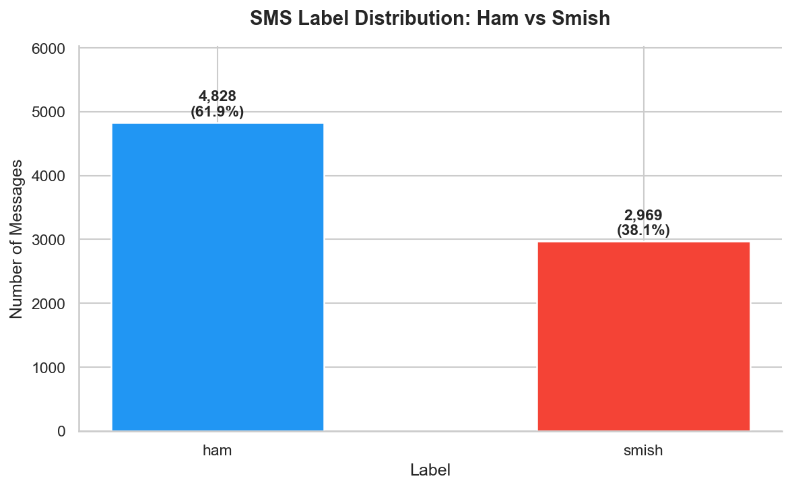
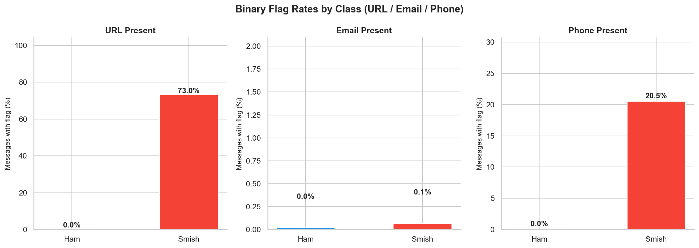
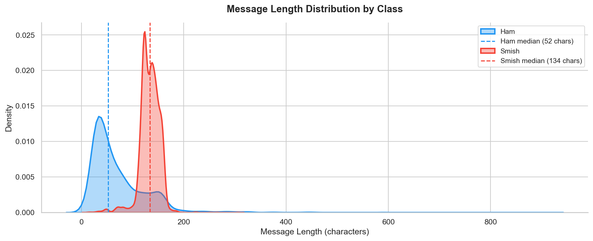
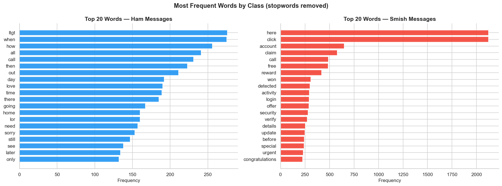
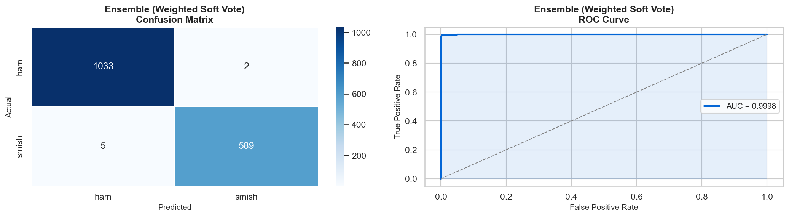

<div align="center">


# SmishGuard: ML Pipeline

**Sentence-BERT embeddings + engineered phishing signals + TF-IDF, fused into a weighted classifier ensemble.**

</div>

Part of the [SmishGuard](../README.md) project. This is the training pipeline that produces the model served by the [backend](../backend/README.md).

## Contents

- [Dataset](#dataset)
- [Pipeline](#pipeline)
- [Engineered Features](#engineered-features)
- [Results](#results)
- [Usage](#usage)
- [File Reference](#file-reference)

## Dataset

| File | Used by | Purpose |
|---|---|---|
| `dataset/merged_dataset.csv` | `MLsmish.py` | Training data: `label` (`ham`/`smish`), `message`, and `url`/`email`/`phone` flags |
| `dataset/dataset_with_new_smish_without_spam.csv` | `create_graph.py` | Source data for the exploratory-analysis graphs |

**Hard-negative augmentation.** The raw dataset is heavily imbalanced on the ham side: only ~40 legitimate messages contain a URL, vs. ~1,100 smish messages that do. That's not enough signal for a classifier to distinguish a real bank SMS from a phishing one, so `MLsmish.py` appends ~120 hand-written realistic ham examples before training: real-looking bank/insurance/government/OTP/delivery/investment notifications across Israeli and international institutions, all containing URLs or financial details. This shifts the ham:smish ratio in the URL subspace from 28:1 to roughly 1:6.5.

## Pipeline

`python MLsmish.py` runs the full pipeline end-to-end:

```
Raw CSV + hard-negative ham
        │
        ▼
 engineer_features()  ──▶  14 text-derived signal columns
        │
        ▼
 80/20 stratified train/test split (seed=42)
        │
        ├──▶ Sentence-BERT (all-MiniLM-L6-v2)  ──▶ 384-dim embedding
        ├──▶ url / phone flags                 ──▶ 2 dims
        ├──▶ engineered signal columns          ──▶ 14 dims
        └──▶ TF-IDF (top 50 terms, 1-2 grams)   ──▶ 50 dims
                        │
                        ▼
              450-dim feature vector
                        │
                        ▼
   GridSearchCV (5-fold, F1) over 5 classifiers
   Logistic Regression · SVM · Random Forest · XGBoost · MLP
                        │
                        ▼
        Weighted soft-voting ensemble (weights = test F1)
                        │
                        ▼
   Decision-threshold tuning (max precision s.t. smish recall ≥ 0.85)
                        │
                        ▼
   Best-F1 candidate saved: smishing_detector.pkl
```

## Engineered Features

`engineer_features()` (in `MLsmish.py`, backed by regex detectors in `NLP_smish.py`) adds these on top of the 3 base `url`/`email`/`phone` flags:

| Feature | Signal type | What it captures |
|---|---|---|
| `avg_word_length` | structural | message length ÷ word count |
| `digit_count` | structural | number of digits in the message |
| `special_char_count` | structural | count of `! $ # * @` |
| `has_shortened_url` | smish | bit.ly / t.co / did.li style shortened links |
| `has_login_words` | smish | "login", "verify", "password", etc. |
| `has_urgency_words` | smish | "urgent", "immediately", "act now" |
| `has_threat_words` | smish | "suspended", "blocked", "legal action" |
| `asks_user_to_act` | smish | explicit call-to-action phrasing |
| `has_suspicious_url_domain` | smish | URL domain doesn't match a known legitimate pattern |
| `has_specific_reference_number` | ham | order/claim/reference numbers (real institutions include these) |
| `contains_official_domain` | ham | URL matches a known bank/gov/official domain |
| `has_exact_amount` | neutral | precise currency amount (appears in both classes) |
| `smish_signal_count` | aggregate | sum of the 6 smish-signal columns |
| `ham_signal_count` | aggregate | sum of the 2 ham-signal columns |

## Results

All 5 candidates plus the ensemble score **95%+ across accuracy, precision, recall, F1, and ROC-AUC** on the held-out test set. The weighted soft-voting ensemble edges out the individual models on F1 and is the model actually saved to `smishing_detector.pkl`.

<div align="center">

</div>

<details>
<summary><b>Dataset exploration (click to expand)</b></summary>
<br>




</details>

<details>
<summary><b>Ensemble evaluation: confusion matrix & ROC curve (click to expand)</b></summary>
<br>

</details>

Individual model evaluations (`logistic_regression_eval.png`, `svm_eval.png`, `random_forest_eval.png`, `xgboost_eval.png`, `mlp_eval.png`) and both correlation heatmaps (`06_correlation_heatmap.png`, `06b_correlation_heatmap_engineered.png`) are in [`graphs/`](graphs/).

## Usage

```bash
pip install sentence-transformers scikit-learn xgboost joblib pandas numpy matplotlib seaborn

# Retrain from scratch: regenerates graphs/ and overwrites the 4 .pkl artifacts
python MLsmish.py
```

**Inference on a single message:**

```python
from MLsmish import predict_message

label, confidence = predict_message("URGENT: Your account is locked. Click http://bit.ly/unlock to verify.")
print(label, confidence)  # e.g. 'smish' 0.94
```

For a quick sanity check against a handful of real-world messages without retraining, edit the `messages` list in `runModel.py` and run it.

## File Reference

| File | Purpose |
|---|---|
| `MLsmish.py` | Training pipeline (`__main__`) + `predict_message()`, the canonical inference entry point used by the backend |
| `NLP_smish.py` | `preprocess_text`, the 3 base regex flags, and the 9 phishing-signal regex detectors |
| `create_graph.py` | Generates the 6 EDA graphs; invoked automatically as a subprocess from `MLsmish.py` |
| `runModel.py` | Manual smoke test against the currently saved model |
| `dataset/` | Training + EDA source CSVs |
| `graphs/` | Generated plots (regenerated on every training run) |
| `smishing_detector.pkl` | The winning trained classifier |
| `label_encoder.pkl` | `LabelEncoder` for `ham`/`smish` |
| `tfidf_vectorizer.pkl` | Fitted `TfidfVectorizer` |
| `smishing_threshold.pkl` | Tuned decision threshold applied at inference |
